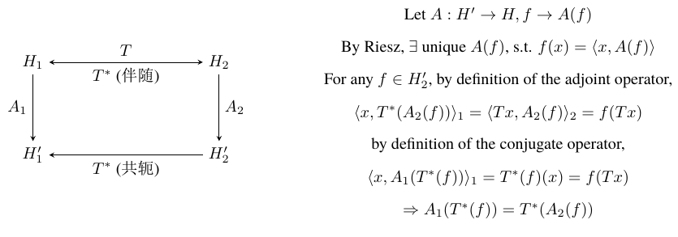
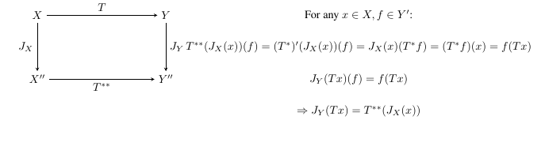

# 有界线性算子

## 线性算子
【定义: 线性算子】设 $(X,\|\cdot\|_X)$ 和 $(Y,\|\cdot\|_Y)$ 为赋范线性空间, 如果 $T(\alpha x + \beta y) = \alpha Tx + \beta Ty$, $x,y \in X,\alpha,\beta \in \mathbb{K}$, 则称算子 T 为线性算子。

【定义: 等距同构】设 $(X,\|\cdot\|_X)$ 和 $(Y,\|\cdot\|_Y)$ 为赋范线性空间, 如果线性算子 T 为一一映射, 且 $\|Tx\|_Y = \|x\|_X$, $x \in X$, 则称 T 为从 X 到 Y (在赋范空间意义下) 的等距同构。若存在这样的 T, 则称 X 与 Y 等距同构。

【例】定义一个算子 $(Tx)(t) = x(a + t(b-a))$, 可以验证该算子为 $T: C[a,b] \to C[0,1]$, 并且为等距同构 (在 $\|\cdot\|_\infty$ 下)。因此空间 $(C[0,1],\|\cdot\|_\infty)$ 和 $(C[a,b],\|\cdot\|_\infty)$ 等距同构。

【注】如果某两个赋范空间等距同构, 那么它们在赋范空间意义下, 结构和性质完全一样, 可以视其为同一个空间。

【定理: 完备化*】一个赋范空间 X, 一定存在一个 Banach 空间 $\hat{X}$ 及其线性子空间 Y, 使得 Y 和 X 等距同构, Y 在 $\hat{X}$ 中稠密, 同时 $\hat{X}$ 在等距同构意义下是唯一的, 即如果还存在另外一个 $X'$ 满足该性质, 那么 X 和 $X'$ 等距同构。称 $\hat{X}$ 为 X 的完备化。

### 线性算子的定义域、值域、零空间
【定义: 算子的定义域、值域、零空间】记线性算子 $T : X \to Y$ 的定义域为 $D(T) \subset X$, 记算子的值域为 $R(T) = \{Tx : x \in D(T)\}$, 即算子的零空间为 $N(T) = \{x \in D(T) : Tx = 0\}$。

- 【性质】若 D(T) 为 X 的线性子空间, 则 R(T) 为 Y 的线性子空间。
- 【性质】T 为单射 当且仅当 N(T)={0}, 证明思路见前一讲的某个证明。
- 【性质】若 dim(D(T)) = n < $\infty$, 则 $dim(R(T)) \leq n$。
  - 【证明】在 R(T) 中找任意 n+1 个元素, 找它们对应 D(T) 中的元素, D(T) 中的 n+1 个元素一定线性相关, 则能找到加权和为零; 同时作用 T 算子, 则可得 R(T) 中的 n+1 个元素也线性相关。

【例】恒等算子 $I_X : X \to X, I_Xx = x$, 有 $D(I_X) = X, R(I_X) = X$。它为线性算子, 也是单射, 满射。

【例】零算子 $0_X : X \to X, 0_X(x) = 0$, 有 $D(0_X) = X, R(0_X) = \{0\}$。它为线性算子。

【例】求导算子 $\frac{d}{dt} : C[a,b] \to C[a,b], \frac{d}{dt}x = x'$, 有 $D(\frac{d}{dt}) = C^1[a,b], R(\frac{d}{dt}) = C[a,b], N(\frac{d}{dt}) = \{x \in C[a,b] : x(t) = c \in \mathbb{K}\}$。

【例】积分算子 $T : C[a,b] \to C[a,b], Tx(t) = \int_a^t x(\tau)d\tau, \forall t \in [a,b]$, 有 $D(T) = C[a,b], N(T) = \{0\}, R(T) = \{x \in C^1[a,b] : x(a) = 0\}$。

【例】内积算子 $T_a : \mathbb{K}^n \to \mathbb{K}, T_ax = \langle\mathbf{x},\mathbf{a}\rangle, \text{for some } \mathbf{a} \in \mathbb{K}^n$, 有 $D(T_a) = \mathbb{K}^n, N(T_a) = \{\mathbf{x} \in \mathbb{K}^n : \mathbf{x} \perp \mathbf{a}\}$, 值域和向量 a 有关。

【性质】对于线性算子 T, 如果 D(T)=X, 并且它为一一映射, 则其逆映射 $T^{-1}$ 也为线性算子。

### 有界线性算子

【定义: 有界线性算子】设 X, Y 为赋范空间, 算子 $T : X \to Y$ 为线性算子, 如果存在常数 $C \geq 0$, 使得 $\|Tx\| \leq C\|x\|, x \in X$, 则称 T 为有界线性算子。

- 【等价定义】如果 T 把任意 X 的有界集映射为 Y 的有界集, 则 T 为有界线性算子。
- 【证明等价性】如果 X 有界, 对于任意的 $y_1,y_2 \in Y$, 有 $x_1,x_2 \in X$, $Tx_1 = y_1,Tx_2 = y_2$, $\|y_1 - y_2\| = \|Tx_1 - Tx_2\| = \|T(x_1 - x_2)\| \leq C\|x_1 - x_2\|$。反之同理。

【定义: 算子的范数】定义 $\|T\| = \sup_{x\in X,x\neq0} \frac{\|Tx\|}{\|x\|}$ 为有界线性算子 T 的范数。

- 【注】由有界线性算子的定义, 知道存在常数 $C \geq 0$, 使得 $\frac{\|Tx\|}{\|x\|} \leq C, \forall x \in X$, 因此可以理解算子的范数是使得上述式子成立的最小常数。也可以写作 $\|Tx\| \leq \|T\| \|X\|$。
- 【等价定义】$\|T\| := \sup_{x\in X,\|x\|\leq1} \|Tx\| = \sup_{x\in X,\|x\|=1} \|Tx\|$
- 【证明等价性】对于 $\forall x,\|x\| \leq 1,\|Tx\| \leq \|T\| \|x\| \leq \|T\| \Rightarrow r \leq \|T\|$, $\forall y \in X,\exists x = \frac{y}{\|y\|}, s.t. \|x\| = 1$, 有 $\|Tx\| = \|T\frac{y}{\|y\|}\| = \frac{\|Ty\|}{\|y\|} \leq r,\forall x \Rightarrow \|T\| \leq r$。

### 有界线性算子空间
【定义: 有界线性算子全体】即 B(X,Y) 为有界线性算子的全体, 当 X=Y 时, 简记为 B(X)。

【定义: 有界线性算子空间】定义 B(X,Y) 上的加法和数乘: 对于 B(X,Y) 中的两个算子 S, T, 有 $(S+T)x = Sx + Tx, (aT)x = aTx, \forall x \in X$。

- 【性质】在上述的定义下, 所构成的空间为线性空间, 称为有界线性算子空间。

【性质: 有界线性算子赋范空间】上述有界线性算子空间加上算子范数的定义, 构成赋范空间。

- 【证明】非负性: 显然 sup 中分母非零, 分子大于零, 非退化性: 如果算子的范数为 0, 则算子把每一个元素映射为 0, 由此该算子为零算子; 反之显然。齐次性: 显然。三角不等式: $\forall S,T \in B(X,Y), \|(S + T)x\| \leq \|Sx\| + \|Tx\| \leq (\|S\| + \|T\|)\|x\|$。

【性质: 复合算子】若 $S \in B(X,Y),T \in B(Y,Z)$, 有 $TS \in B(X,Z)$ 以及 $\|TS\| \leq \|T\| \|S\|$。

- 【证明】$\|TSx\| \leq \|T\| \|Sx\| \leq \|T\| \|S\| \|x\|,\forall x \in X$。
- 【注】特别地, 如果 $T \in B(X)$, 则 $\|T^n\| \leq \|T\|^n$。

【例】设 X = Y = C[a,b], 考虑范数 $\|\cdot\|_\infty$ 和积分算子 T (见前定义), 有 $\|T\| = b - a$。

- 【证明】
$\|Tx\|_\infty = \max_t |\int_a^t x(t')dt'| \leq \max_t \int_a^t |x(t')|dt' \leq \int_a^b |x(t')|dt'$
$= (b-a)\|x\|_\infty$
取 $x(t) = 1, \forall t \in [a,b]$, 有 $(b - a)\|x\| = \|Tx\| \leq \|T\| \|x\|$。

【例】设 X = $C^1[a,b]$, Y = C[a,b], 考虑范数 $\|\cdot\|_\infty$ 和求导算子 $\frac{d}{dt}$ (见前定义), 考虑 $x_n(t) = t^n,x_n \in B(X,Y)$, 则 $\|T_n\| = n$, 由此求导算子不是有界算子。

【例】设 X = Y = $l^\infty$, 考虑范数 $\|\cdot\|_\infty$ 和定义个 a $\in l^\infty$ 的内积算子 $T_a$ (见前定义), 则 $\|T_a\| = \|a\|_\infty$。

- 【证明】$\forall x \in l^\infty,\|T_ax\| \leq \|a\|_\infty\|x\| \Rightarrow \|T\| \leq \|a\|_\infty$。根据 $\|\cdot\|_\infty$ 的定义, 一定存在某个 n, 使得 $a_n \approx \|a\|_\infty$, 考虑只在这一个位置上有 1, 其他位置上均为 0 的向量 x, 可以证明 $\|T\| = \sup_{x\neq0} \|Tx\| = \|a\|_\infty$。

【性质】若 X 为有限维赋范空间, Y 为赋范空间, T:X→Y 为线性算子, 则 T 必为有界线性算子。

- 【证明】有限维则有 Hamel 基 {$x_i$}, 对于任意的 x ∈ X, 有 $\|Tx\| = \|T(\sum a_ix_i)\| = \|\sum a_iTx_i\| \leq \|a_1\| \|Tx_1\| + \cdots + |a_n| \|Tx_n\|$ $\leq \max(\|Tx_i\|)\|x\|_1 \leq \frac{1}{C} \max(\|Tx_i\|)\|x\|_1$。其中第一个等号使用 Hamel 基的性质, 第二个等号使用线性算子定理, 第一个不等号使用范数的三角不等式, 第三个等号使用 $\|\cdot\|_1$ 和 $\|\cdot\|$ 的等价性。

## 有界性和连续性等价

【性质: 算子有界性和连续性等价】设 X, Y 为赋范空间, T:X→Y 为线性算子, 则以下命题等价:
1) T 在 x=0 处连续;

2) T 是连续的; 
 
3) T 为连续映射; 
 
4) T 为有界线性算子。

- 【证明】充分利用连续性的 $\epsilon - \delta$ 描述、算子的线性性质和有界线性算子的定义即可证明。
- 【性质】设 X, Y 为赋范空间, T:X→Y 为线性算子, 则 T 为连续映射当且仅当 T 为有界线性算子。
- 【证明】回顾到连续映射的等价条件: 如果集合为闭集, 那么其逆映射一定为闭集。由于像空间中的 {0} 为闭集, 因此 N(T) 也应该为闭集。

【性质: 算子空间完备性】设 X 为赋范空间, Y 为 Banach 空间, 则 B(X,Y) 为 Banach 空间。

- 【证明】1. 设一个 B(X,Y) 中的柯西列 $T_n$; 2. 转化为 Y 空间的柯西列 $\|T_n x - T_m x\| \leq \|T_n - T_m\| \|x\|$; 3. Y 空间存在收敛子列 $T_n x$; 4. 证明算子 T 为线性算子并且有界。

【定义: 延拓, 限制】设 X, Y 为非空集合, $X_0 \subset X$ 为非空子集, 又设 $T : X \to Y, S : X_0 \to Y$, 若 $Sx = Tx,\forall x \in X_0$, 则称 T 为 S 的延拓, S 为 T 在 $X_0 \subset X$ 上的限制。

【性质】设 X 为赋范空间, Y 为 Banach 空间, $X_0 \subset X$ 为 X 的稠密线性子空间, 设 $T_0 \in B(X_0,Y)$。则存在唯一的 $T \in B(X,Y)$ 为 $T_0$ 的延拓, 且 $\|T_0\| = \|T\|$。

- 【证明延拓】由稠密性, 任意 X 中的元素 x, 都有 $X_0$ 中的柯西列收敛到 x, 令 $Tx = \lim_{n\to\infty} T_0x_n$, 可以证明算子 $T : X \to Y$ 在 $X_0$ 上和 $T_0$ 有一样的取值, 即 T 为 $T_0$ 的延拓。
- 【证明 T 为线性有界】线性可以由 $T_0$ 算子的线性性收敛到极限得到; 有界可以通过递出 $\|Tx\| \leq \|T_0\|$ 得到。同时, 这也说明了延拓是唯一的。
- 【证明 $\|T_0\| = \|T\|$】由于 $\|T\|$ 定义中的 sup over 的范围完全涵盖 $\|T_0\|$, 因此 $\|T\| \geq \|T_0\|$; 和前面联系起来可得。
- 【延伸性质】如果存在另一个 T', 对于任意 $x_0 \in X_0$, 都是 T 和 T' 都对同样的元素赋予一样的值(延拓定义), 那么对于任意 x, 有 $\|Tx - T'x\| \leq \|T - T'\| \|x\|$, 有线性性质可以证明它们相等。

## 有界线性泛函

### 线性泛函空间

【定义: 线性泛函】X 为线性空间, $f : X \to \mathbb{K}$ 为线性算子, 则称 f 为 X 上的线性泛函。

【定义: 对偶空间】若 X 为线性空间, 把 X 上所有线性泛函的全体记为 X*, 称为 X 的代数对偶空间*; 若 X 为赋范空间, 把 X 上所有有界线性泛函的全体记为 X', 成为 X 的拓扑对偶空间, 简称对偶空间/共轭空间。

【定义: 范数】$\|f\| = \sup_{x\in X,x\neq0} \frac{|f(x)|}{\|x\|}$。

- 和普通有界线性算子*范数的定义一致

【例】在 $\mathbb{K}^n$ 上赋予范数* $\|\cdot\|_2$, 定义线性泛函* $f_a(x) = \sum_{i=1}^n a_ix_i$, 有 $\|f_a\| = \|a\|_2$。

- 【证明】$|f_a(x)| \leq \sum_{i=1}^n |a_i||x_i| \leq \|a\|_2\|x\|_2 \Rightarrow \|f_a\| \leq \|a\|_2$; 同时, 取 x = a, 可以推出 $\|f_a\| \geq \|a\|_2$。

【例: Dirac 泛度】对于 X=C[a,b] 和范数 $\|\cdot\|_\infty$, 对于某个 $t_0 \in [a,b]$, 定义泛函 $\delta_{t_0}(x) = x(t_0), x \in C[a,b]$, 有 $\|\delta_{t_0}\| = 1$。

- 【证明】根据定义, 容易看到 $|\delta_{t_0}(x)| \leq \|x\|_\infty \Rightarrow \|\delta_{t_0}\| \leq 1$, 同时取 x 为恒为 1 的函数, 有 $\|\delta_{t_0}\| \geq 1$。

【性质: X* 为线性空间】对于线性空间 X, 可以定义加法和数乘 $(f + g)(x) = f(x) + g(x), (\lambda f)(x) = \lambda f(x)$, 在此定义下下, X* 为线性空间。

【性质: 泛函的表示】设 M = {$x_1,\cdots,x_n$} 为 X 的 Hamel 基, 则 X* 中的任意泛函 f 可以由它在 M 上的值 f($x_i$) 唯一确定。

- 【证明】对于任意的 x ∈ X, 都可以找到系数 $\lambda_1,\cdots,\lambda_n$ 使得 x 按照元素 $x_i$ 的加权和*。由于 X* 也为线性空间, 因此 f(x) 也可以按照元素 f($x_i$) 的加权和。唯一性: 如果对于某个 M 中的元素 $x_i$, f($x_i$) 和 g($x_i$) 不同, 则 g ≠ f; 如果对于 M 中的任意元素都相同, 那么对任意的 x ∈ X, 也能够 f(x) = g(x), 则有 g=f。

【性质: 泛函的 Hamel 基】设 M = {$x_1,\cdots,x_n$} 为 X 的 Hamel 基, 于是对于任意 x = $\sum \lambda_ix_i$, 定义 $\phi_i(x) = x_i$, 有 {$\phi_1,\cdots,\phi_n$} 为 X* 的 Hamel 基, 以及 dim(X*) = n。

- 【证明】对于任意的 X* 中的泛函都能表示为 f = $\sum_{i=1}^n f(x_i)\phi_i$ 的线性组合, 从而 X* = span{$\phi_1,\cdots,\phi_n$}; 同时可以说明明 {$\phi_1,\cdots,\phi_n$} 线性无关。

【定义: 对偶基】M = {$x_1,\cdots,x_n$} 为 X 的 Hamel 基, {$\phi_1,\cdots,\phi_n$} 为 X* 的 Hamel 基, 称 M = {$x_1,\cdots,x_n$} 和 {$\phi_1,\cdots,\phi_n$} 为对偶基*。

### X' 和 X* 的关系

【性质: X' 和 X* 的关系】若 X 为赋范空间, X' 为 X* 的线性子空间*。

【定理: X' = X* 的充要条件】设 X 为赋范空间, X' = X* 当且仅当 X 为有限维空间*。

- 【证明】当 X 的维度有限的时候, 前面有定理告诉我们, 从有限维赋范空间出发的线性算子都是有界的, 因此 X'=X*。当 X 维度无限的时候, 存在元素无限的 Hamel 基地, 可以定义一个 f 使得它属于 X* 但是不属于 X'。

【例】赋范空间 $(l^\infty,\|\cdot\|_\infty)$ 的线性子空间 $c_0 = \{\{x_n\} \in l^\infty : x_n \to 0\}$, $(c_0)' = l^1$。

- 【证明】证明两个空间相等 (等距同构), 需要构造一个从前一个空间到后一个空间的一一映射。构造 $T : (c_0)' \to l^1, f \to \{f(e_i)\}$, 其中 $e_i = \{\delta_{ij}\} \in c_0$, 表示只在第 i 位为 1, 其他位为 0 的数列。要证明: 
  1) $\{f(e_i)\} \in l^1$, 通过算子的有界性和线性性可得; 
  2) 证明它为单射, 即对于任意的 $f,g \in c_0, f(e_i) = g(e_i),\forall i$, 则有 f=g; 
  3) 证明它为满射, 即对于任意的 $\alpha \in l^1$, 都存在 $f \in c_0$, 使得 $Tf = \alpha$, 通过令 $f(x) = \sum_{i=1}^\infty \alpha_ix_i$ 可得。

【例】对于赋范空间 $(l^1,\|\cdot\|_1)$, 有 $(l^1)' = l^\infty$。

- 【证明】证明方法类似。

【例】对于赋范空间 $(l^p,\|\cdot\|_p)$, 有 $(l^p)' = l^q$, 其中 $1/p + 1/q = 1$。

- 【证明】证明思路类似。其中需要证明 $\{f(e_i)\} \in l^q$, 即$\|\{f(e_i)\}\|_q \leq \|f\|$, 只需要找到一个 $x = \{\frac{|f(e_i)|^q}{f(e_i)}\mathbb{I}(f(e_i) \neq 0)\} \in l^p$, 根据 $\|f\|$ 的定义即可说明。

## Hahn-Banach 定理

【定义: 次线性泛函*】设 X 为线性空间, 定义在 X 上的函数 $p : X \to \mathbb{R}$ 满足
1. $p(\alpha x) = \alpha p(x), \forall x \in X, \alpha \geq 0$；
2. $p(x + y) \leq p(x) + p(y), \forall x, y \in X$。
则称 p 为 X 上的次线性泛函。

【定义: 半范数】设 X 为线性空间, X 上的函数 $p : X \to \mathbb{R}$ 满足
1. $p(x) \geq 0, \forall x \in X$；
2. $p(x + y) \leq p(x) + p(y), \forall x, y \in X$；
3. $p(\alpha x) = |\alpha|p(x), \forall x \in X, \alpha \in \mathbb{K}$。
则称 p 为 X 上的半范数。

【定理: 实线性空间上的一维 Hahn-Banach 定理】设 X 为实线性空间, p 为 X 上的次线性泛函, Y 为 X 的线性子空间*, 且 $\dim(X\backslash Y) = 1$。若存在 Y 上的线性泛函, 满足函数 $f(x) \leq p(x), \forall x \in Y$, 则存在 X 上的线性泛函 g, 使得 $g|_Y = f, g(x) \leq p(x), \forall x \in X$。

- 【证明】由于 $\dim(X\backslash Y) = 1$, 可以存在一个一维的延拓向量 $x_0$, 使得 $X = Y + \mathbb{R}x_0$。对于任意的 $x \in X$, 都存在唯一的 $y \in Y$ 和 $\alpha \in \mathbb{R}$, 使得 $g(x) = g(y + \alpha x_0) = f(y) + \alpha g(x_0)$。上述定义显然完成了线性延拓, 条件 $g|_Y = f$。因此只需要证明满足条件 $g(x) \leq p(x), \forall x \in X$。可以通过最大-最小不等式原理证明。

【定理: 实线性空间上的 Hahn-Banach 定理】设 X 为实线性空间*, p 为 X 上的次线性泛函, Y 为 X 的线性子空间; 若 Y 上存在线性泛函, 并且满足 $f(x) \leq p(x), \forall x \in Y$, 则存在 X 上的线性泛函 g, 使得 $g|_Y = f, g(x) \leq p(x), \forall x \in X$。

- 【注】这里需要注意小 $\dim(X\backslash Y) = 1$ 的要求。
- 【证明】对于集合 $\{(Z, h) : Y \subset Z \subset X, h \in X^*, h|_Y = f, h(x) \leq p(x)\}$，定义半序关系 $(Z_1, h_1) \leq (Z_2, h_2) \Leftrightarrow Z_1 \subset Z_2, h_2|_{Z_1} = h_1$, 利用整体 Zorn 引理, 存在极大元* $(Z, h)$。若存在极限元不等于 Z=X, 这是矛盾的, 因为可以利用一维定理继续延拓。因此方法找到一个延拓, 便得到延拓大于 $(Z, h)$。

【性质: 复线性空间】设 X 为复线性空间*, f 为 X 上的线性泛函, 则 $\Re(f) \in X_R'$，其中 $X_R$ 和 X 在复上一样的, 只是线性结构定义在实数上并对复数取实部, 并且, 任意给定 $f_1 \in X_R'$，都取 $f(x) = f_1(x) - if_1(ix)$。

- 【证明】主要是观察到 $f(ix) = if(x)$。

【定理: 复线性空间上的 Hahn-Banach 定理】设 X 为复线性空间, p 为 X 上的半范数, Y 为 X 的线性子空间; 若 Y 上存在线性泛函 f, 满足 $|f(x)| \leq p(x), \forall x \in Y$, 则存在 X 上的线性泛函 g, 使得 $g|_Y = f, |g(x)| \leq p(x), \forall x \in X$。

- 【注】这里需要注意为复线性空间, 相应地, p 变成了半范数。
- 【证明 $f : X \to \mathbb{R}$ 情形】若任意半范数 $|f(x)| \leq p(x), \forall x \in Y$ 的小细节 $|f(x)| \leq p(x), \forall x \in Y$：首先需要保证条件的 g, 满足 $g(x) \leq p(x), \forall x \in X$；另外一侧再证明 $-g(x) \leq p(x)$ 即可。
- 【证明 $f : X \to \mathbb{C}$ 情形】首先证明存在满足条件的 $g_1$, 再下一步证明存在满足条件的 $g_2$, 最后证明一定会存在满足条件的 g, 最后不断地推进使得 g 满足上述所有条件, 最后证明到 $g(x) = |g(x)|e^{i\theta}$, for some $\theta$。

### 推论

【定理: 有界泛函*的保范延拓】设 X 为赋范空间*; Y 为 X 的线性子空间; f 为 Y 上的线性泛函, 则存在 X 上的线性泛函 g 使得 $g|_Y = f, \|g\| = \|f\|$。

- 【注】这说明任子空间上的有界线性泛函可以延拓到整个空间并且范数不变。
- 【证明】令 $p(x) = \|f\| \|x\|$, 证明它为半范数*, 然后套用前面的定理即可证明。注意到 $|g(x)| \leq p(x), \forall x \in X$ 可以推导到 $\|g\| \leq \|f\|$。$g|_Y = f$ 可以推导到 $\|g\| \geq \|f\|$。

【定理: Hilbert 空间中的保范延拓】设 X 为 Hilbert 空间, Y 为 X 的闭线性子空间, $f(x) = \langle x, x_0\rangle$ 为 Y 上的线性泛函, 则存在唯一一的保范延拓 $g(x) = \langle x, x_0\rangle$。

- 【证明】存在性通过前面的结论可以直接证明。唯一性: 假设存在 $x_1$, 那么根据 $g|_Y = f$ 可以得出 $\langle x, x_0 - x_1\rangle = 0, \forall x \in Z \Rightarrow x_0 - x_1 \in Z^\perp$。又根据保范的性质, 有 $\|x_0 - x_1\|^2 = \|x_0\|^2 = 0$。

【性质】设 X 为赋范空间, $x_0$ 为 X 中的非零元素, 则存在 X 的线性泛函 f 使得 $\|f\| = 1, f(x_0) = \|x_0\|$。

- 【证明】构造一维子空间 Y = $\mathbb{K}x_0$ 和上面的泛函 $f(\lambda x_0) = \lambda\|x_0\|$, 证明它是线性泛函并且有界, 再使用前一定理即可得到保范延拓。
- 【推论】X' 可用来分离 X 中的点: $x = y \Leftrightarrow f(x) = f(y),\forall f \in X'$。换句话说, 只要 $x \neq y$, 就可以找上面那样的泛函 $x_0 = x - y$ 构造 f, 从而使得 $f(x) \neq f(y)$。

【性质】设 X 为非零赋范空间, x 为 X 中的元素, 则
$\|x\| = \max_{f\in X',f\neq0} \frac{|f(x)|}{\|f\|} = \max_{f\in X',\|f\|≤1} |f(x)|$。

- 【证明】首先保证定义义项 $\|x\| \geq \sup_{f\in X',f\neq0} \frac{|f(x)|}{\|f\|}$；根据前一定理, 存在泛函 f 使得 $\|f\| = 1, f(x) = \|x\|$。因此上界界*, 存在并且能取到 $\|x\|$。

【性质】设 X 为赋范空间, Y 为 X 的闭线性子空间*, $\forall x$, $x_0 \in X\backslash Y$, 令 $\delta = \rho(x_0,Y) = \inf_{y\in Y} \|x_0 - y\|$。则存在 $f \in X'$, 使得 $\|f\| = 1, f|_Y = 0, f(x_0) = \delta$。

- 【证明】构造一个小子 Y 和 X 之间的子空间 $Z = \text{span}(Y \cup \{x_0\})$, 证明该子空间上的函数 $h(x) = h(y + \lambda x_0) = \lambda\delta$ 为线性有界泛函, 并且 $\|h\| = 1$。再利用最前面的延拓定理*即可得证。

【性质】若 X 为赋范空间, X' 为可分空间, 则 X 为可分空间*。

- 【证明】X' 为可分空间, 则 X'上单位球强可分; 在单位球面上找一个稠密可数子集: 对于该集合中每一个元素 $f_n$ 都能找到一个对应的 $x_n \in X, s.t. \|x_n\| = 1, f_n(x_n) \geq 1/2$。利用反证法*和前一性质可知, $X = \text{span}(x_1,\cdots,x_n)$。至此利用稠密性和单位球面上的 f, 使得{距离在集 $f_n$ 都较远, 接下来, 证明 X 空间中的稠密子集且 Q"* 等等。

### 共轭算子

【定义: 共轭算子】设 X, Y 为赋范空间, 对于一个线性有界算子 $T \in B(X,Y)$, 定义 $T^* : Y' \to X', T^*(f)(x) := f(Tx)$ 为算子 T 的共轭算子。

【定理: 共轭算子范数不变】设 X, Y 为赋范空间, $T \in B(X,Y)$, 则 T* 为线性有界算子, 即 $T^* \in B(Y',X')$, 并且 $\|T^*\| = \|T\|$。

- 【证明】根据算子 T 的线性容易证明 T* 的线性。
$|f(Tx)| \leq \|f\| \|T\| \|x\| \to \|T^*f\| \leq \|T\| \|f\| \to \|T^*\| \leq \|T\|$。同时注意到共轭算子作用于 Y 上的一个泛函, 根据前面的定理可以知道存在一个泛函 $f : \|f\| = 1, f(y) = \|y\|, y \in Y$, 因此可以推出另一半不等式。

【例】考虑 $\mathbb{K}^m \stackrel{T}{\to} \mathbb{K}^n \stackrel{f}{\to} \mathbb{K}$, 线性算子 T 可以表示为矩阵形式 y=Ax, 线性算子 f 可以表示为向量 $f^T y$, 根据共轭算子的定义, $T^*(f)(x) = f(Tx) = f^T Ax = (A^T f)^T x$, 由此可见, 对于作用于 f 上的共轭算子可被写作 $T^*(f) = Bf = A^T f$, 即共轭算子的矩阵表示是原算子矩阵*表示的转置, 即 $B = A^T$。

【性质: 共轭算子】设 X, Y, Z 为赋范空间, $S,T \in B(X,Y), P \in B(Y,Z), \alpha \in \mathbb{K}$, 则

1. $(S + T)^* = S^* + T^*$
2. $(\alpha S)^* = \alpha S^*$
3. $(PS)^* = S^*P^*$

- 【证明】根据各个算子的线性和共轭算子的定义容易证明。
- 【注】通过前两条性质可以看出, 如果把【共轭】看做一个线性算子的话 $*: B(X,Y) \to B(Y',X'), T \to T^*$, 该算子为线性算子。
- 【注】注意到共轭算子和伴随算子的符号是相同的, 但是它们的定义域和值域都不相同。共轭算子和伴随算子有如下等价关系。

### 典范映射和自反空间
【定义: 典范映射 (canonical embedding)】定义典范映射 $J : X \to X'' = (X')'$, $x \to g_x$, 其中 $g_x(f) := f(x), \forall f \in X'$。

【性质: 典范映射线性】$g_x$ 为线性, 并且 $\|g_x\| = \|x\|$; J 为线性, 并且 $\|J(x)\| = \|x\|$。

- 【证明】根据定义和其作用于线性函数可以推导到线性; 根据 $\|f\|$ 和 $g_x$ 的定义可以推导出 $\|g_x\| \leq \|x\|$; 根据 Hahn-Banach 可以说明存在取等号的情况, 即有 $\|g_x\| \geq \|x\|$。

- 【注】X'' 是为 Banach 空间, 并且 $J : X \to X''$ 为等距同构, 可以把 X 看做 X''的赋范子空间, 因此, 经常把 X 中的问题转化到 X'' 中。

- 【注】如果把 X 看做 X'' 的赋范子空间, 把 Y 看做 Y'' 的赋范子空间, 则可以把 T** 看做是 T 的延拓, 有如下关系。

【定义: 自反空间 (reflexive space)】如果典范映射 $J : X \to X''$ 为满射，则称 X 为自反空间。

- 【等价定义】任意给定 $f \in X''$，存在 $x \in X$，使得任意 $f \in X'$，都有 $f(x) = f(x)$。

【性质】若 X 为自反空间，则 X 为 X'' 等距同构，X 为 Banach 空间。

【定义: 自反空间判别】空间 $l^p$ 和 $L^p$ 对于 $1 < p < \infty$ 时为自反空间。

- 【证明】利用 Riesz 定理：如果 X 为 Hilbert 空间，对于任意的 $f \in X'$，都有 $f(x) = (x,z_0)$，for some $z_0$，可以定义 $A : f \to z_0$。
- 【注】对于 Hilbert 空间，利用 Riesz 定理，对于任意的 $f \in X'$，都有 $f(x) = (x,A(f))$，for some $A$，其中 $(x,y)$ = $(y,x)$。对于每个元素都能找到 Hilbert 空间中的一个元素与之对应。因此 $f_1 = f(x_1) \in X''$，可得 $f_1(f) = (f,h)$ = $(A(f),h)$ = $f(A(h))$。

【性质】$l^p$ 为可分空间。

- 【证明】对于 $\forall f \in (l^p)'$，对于 $\forall x$，$x + f(x) = \sum a_ix_i$。
- 【注】对于任意的 $x \in l^p$，都可以写成 $x = \sum_{i=1}^n a_ie_i$，其中 $e_i$ 为一个不，因此存在了一个一一，对于每个一个，都对应了一个 y；因此也就说明了 $f(x) = f(x)$。

【例】X 不完备则不可能自反空间。

- 【证明】若 X 为自反空间且不完备，则 $\dim(X'') = \dim(X)$，但是为完备空间，因此 X 一定为完备空间，即 X 一定为 Banach 空间。

【例】$c_0$ 不为自反空间。

- 【证明】$(c_0)'' = (l^1)' = l^\infty \neq c_0$，因此不可与自己同构，因此不可能自反。

【例】$l^1$ 不为自反空间。

- 【证明】同样利用可分性，$l^1$ 可分，但是 $(l^1)' = l^\infty$ 不可分。
- 【注】$l^\infty$ 也不是自反空间，但用这个方法证明不了。

## 一致有界性原理

【定理: 一致有界性原理 (uniform boundedness theorem / Banach-Steinhauss theorem)】设 X 为 Banach 空间，Y 为赋范空间，$(T_i)_{i\in I} \subset B(X,Y)$，若任取 $x \in X$，有 $\sup_i \|T_ix\| < \infty$，则 $\sup_i \|T_i\| < \infty$。

- 【证明】令 $M_n = \{x \in X : \sup_i \|T_ix\| \leq n\}$，根据题设条件可以说明 $X = \cup M_n$。同时，由于 T 们都是连续映射，因此任意 $M_n$ 中的数列如果收敛的话，一定也收敛到 $M_n$ 中；这说明 $M_n$ 为闭集，$M_n = \bar{M_n}$。根据完备性和前一定理，存在一个开球 $B(x,r)$ 被包含在某个 $M_n$ 中，即 $x \in M_n, x + ry/2 \in M_n, \forall y \in X, \|y\| \leq 1$。根据 M 集合的定义和三角不等式，可以说明 $\sup_{\|y\|\leq1} \|T_iy\| \leq 4n/r$，即可以说明 $\|T_i\|$ 有界。

【推论: 逆否命题】如果 $\sup_i \|T_i\| = \infty$，则存在一个 $x_0 \in X$，使得 $\sup_i \|T_ix_0\| = \infty$。

- 【注】正常情况下，对于任意 $T_i$，存在 $x_i \in X, \|x_i\| = 1, s.t. \|T_ix_i\| \geq \|T_i\|/2$，因此有 $\sup_i \|T_ix_i\| = \infty$，这里说明可以取同一个点 $x_0$，称该点为共鸣点。

## 开映射定理和闭图像定理

### 开映射定理

【定义: 开映射】设 X, Y 为赋范空间, T: X→Y 为映射, 如果 T 将开集映射为开集, 则称 T 为开映射。

- 【注】前面的例子中, T 为连续映射的充要条件是【只要像是开集, 那么逆像一定是开集】, 这里映射是【开集映射为开集】, 这两个不一样。

【定理: 开映射定理】设 X, Y 为 Banach 空间, 若 $T \in B(X,Y)$ 为满射, 则 T 必为开映射, 特别地, 若 T 为一一映射, 则 $T^{-1} \in B(X,Y)$。

【性质: 定义等价范数的充要条件 (等价定理)】令 $(X,\|\cdot\|_a)$ 和 $(X,\|\cdot\|_b)$ 为 Banach 空间, 并且 $\exists c > 0, s.t. \|x\|_a \leq c\|x\|_b, \forall x \in X$, 则另一个不等式成立。

- 【证明】构造 $T : (X,\|\cdot\|_b) \to (X,\|\cdot\|_a)$, 容易看出它为一一映射, 根据前面的判别, 它是连续的, 因此它的逆映射也是连续的, 可以说明它为等价范数。

### 闭图像定理

【定义: 笛卡尔积】设 X, Y 为赋范空间, 令 $Z = X \times Y = \{(x, y) : x \in X, y \in Y \}$, 定义范数 $\|(x, y)\| = \|x\|_X + \|y\|_Y$。

【性质】上述定义的范数完备, 并且如果 X 和 Y 都为 Banach, 则 Z 也为 Banach。

- 【证明】完备性容易检查可得, 构造一个 Z 中的柯西列, 那么对应的 x, y 有定也是柯西列; x, y 收敛, 则 z 也收敛。

【定义: 闭图子】设 X, Y 为赋范空间, D(T) 为 X 的线性子空间, $T : D(T) \to Y$ 为线性算子, 称算子 T 的图像 $G_T = \{(x,Tx) \in X \times Y : x \in D(T)\}$ 为闭集时, 则称 T 为闭算子。

【注】下述三个例子和闭图像定理相说明: 如果 $D(T) = X$, 则线性有界算子都能证明闭算子; 如果 $D(T) \neq X$, 则闭不完全性质算子和线性有界算子不等价; 但是 D(T) 为 X 的闭线性子空间 (或者且有完备性条件的时候), 闭算子能够比线性有界算子更多。

【例】如果 D(T) = X, 并且 $T \in B(X,Y)$, 则它为闭算子。

- 【证明】根据闭集的定义, 其中的任意一个收敛列 $(x_n, y_n) \in G_T$, $(x_n,Tx_n) \to (x,y) \in Z$, 目标是证明 $(x,y) \in G_T$。

【例】考虑 X=Y=C[0,1], 求导算子 $T : C^1[0,1] \to C[0,1], x \to x'$, 该线性算子为闭算子, 但是不有界。

- 【证明】证明思路类似, 说明 T 的图像中的收敛列收敛到 T 的图像中。

【例】设 X 为赋范空间, Y 为 X 的闭线性子空间, 并且 $Y \subsetneq X$, 考虑算子 $T : Y \to X, x \to x$, 该算子不为闭算子。

【定理: 闭图像定理】设 X, Y 为 Banach 空间, $D(T) \subset X$ 为闭线性子空间, 如果 $T : D(T) \to Y$ 为闭算子, 则 T 为有界线性算子。

- 【证明】构造算子 $G : G_T \to D(T), (x,Tx) \to x$, 可以证明它为一一映射并且为有界算子, 根据开映射定理, 其逆映射为线性有界算子。

- $\|Tx\|_Y \leq \|x\|_X + \|Tx\|_Y = \|(x,Tx)\| = \|P^{-1}x\| \leq \|P^{-1}\|\|x\|_X$, 即说明得了 T 为线性有界算子。

【注】闭图像定理给出了一个证明线性有界算子的方法, 注意到证明一个算子为闭算子比证明它为线性有界算子更容易, 闭算子证明只需要证明 $(x_n,Tx_n)$ 收敛, 那么 $\lim_{n \to \infty} Tx_n = y = Tx$ (即对于任意的 $x_n \to x$, $\lim_{n \to \infty} Tx_n = Tx$), 证明线性有界算子需要证明对于任意的 $x_n \to x$, $Tx_n$ 收敛, 并且 $Tx_n \to Tx$。
