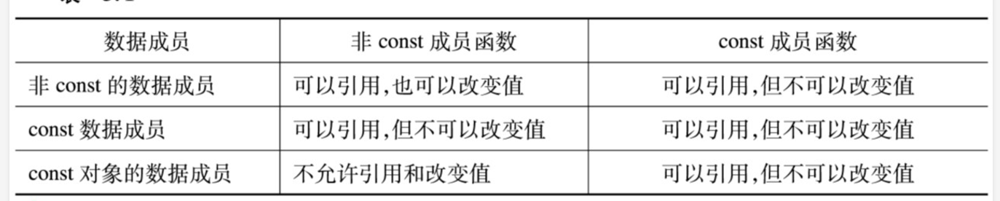

# 怎样使用类和对象
## 利用构造函数对类对象进行初始化
### 对象的初始化
对象的初始化工作 一般可通过类的一个公有接口来赋值,一般是通过一个构造函数来进行
### 用构造函数来实现数据成员的初始化
构造函数是一种特殊的成员函数，与其他成员函数不同，不需要用户来调用它，
而是在建立对象时自动执行。它与所在的类同名。

如
```cpp
#include <iostream>

class Point {
public:
    int x, y;

    // 默认构造函数
    Point() : x(0), y(0) {}
};

int main() {
    Point p; // 使用默认构造函数初始化，x 和 y 都被初始化为0
    std::cout << "Point p: (" << p.x << ", " << p.y << ")" << std::endl;
    return 0;
}
```

注意
>1. 构造函数的名字必须与类名相同,可以在类内部定义，也可以在类外部定义。
>2. 构造函数没有返回类型，即使是void也不可以。
>3. 构造函数可以带形式参数也可以不带，但其后的“()”不能省略。
>4. C++规定，每个类必须有一个构造函数，没有构造函数，就不能创建任何对象。构造
函数可以重载，即一个类中可以有一个或多个构造函数，每个构造函数采用不同的方
式完成数据成员的初始化。
>5. 构造函数不能像其他成员函数那样显式地被调用，它在声明对象时由系统自动调用
>6. 构造函数的访问权限应为public。
>7. 可以用一个类对象初始化另一个类对象
>8. 构造函数最重要的作用是创建对象
>9. 在没有构造函数的时候,系统会默认提供一个构造函数,一旦你提供了构造函数却没有赋值,就会出问题

### 带参数的构造函数
例子如下:
```cpp
#include <iostream>
#include <string>

class Person {
private:
    std::string name;
    int age;

public:
    // 带参数的构造函数
    Person(const std::string& name, int age) : name(name), age(age) {}

    // 显示个人信息的成员函数
    void displayInfo() const {
        std::cout << "Name: " << name << ", Age: " << age << std::endl;
    }
};

int main() {
    // 使用带参数的构造函数创建Person对象
    Person person1("Alice", 30);
    Person person2("Bob", 25);

    // 使用成员函数displayInfo显示对象的信息
    person1.displayInfo();
    person2.displayInfo();

    return 0;
}
```
### 用参数初始化表对数据成员初始化

其一般形式如下:

```cpp
class ClassName {
private:
    Type1 member1;
    Type2 member2;
    // ...其他成员变量

public:
    // 构造函数，带有参数初始化表
    ClassName(ParameterType1 param1, ParameterType2 param2)
    : member1(param1), member2(param2) // ...初始化其他成员变量
    {
        // 构造函数体
        // 在这里可以放置除了成员变量初始化之外的代码
    }

    // ...其他成员函数
};
```
例子如下:
```cpp
#include <iostream>
#include <string>

class Person {
private:
    std::string name; // 成员变量：名字
    int age;         // 成员变量：年龄

public:
    // 构造函数，使用参数初始化表
    Person(const std::string& name, int age) : name(name), age(age) {}

    // 显示个人信息的成员函数
    void displayInfo() const {
        std::cout << "Name: " << name << ", Age: " << age << std::endl;
    }
};

int main() {
    // 使用构造函数创建Person对象，并初始化成员变量
    Person person("Alice", 30);
    
    // 使用成员函数displayInfo显示对象的信息
    person.displayInfo();

    return 0;
}
```
### 构造函数的重载
例子如下:
```cpp
#include <iostream>
#include <string>

class Person {
private:
    std::string name;
    int age;

public:
    // 无参数的默认构造函数
    Person() : name("Unknown"), age(0) {}

    // 带一个参数的构造函数，只初始化名字
    Person(const std::string& name) : name(name), age(0) {}

    // 带两个参数的构造函数，初始化名字和年龄
    Person(const std::string& name, int age) : name(name), age(age) {}

    // 显示个人信息的成员函数
    void displayInfo() const {
        std::cout << "Name: " << name << ", Age: " << age << std::endl;
    }
};

int main() {
    // 使用不同的构造函数创建Person对象
    Person person1; // 使用默认构造函数
    Person person2("Alice"); // 使用一个参数的构造函数
    Person person3("Bob", 25); // 使用两个参数的构造函数

    // 使用成员函数displayInfo显示对象的信息
    person1.displayInfo();
    person2.displayInfo();
    person3.displayInfo();

    return 0;
}
```

### 使用默认参数的构造函数
例子如下:
```cpp
#include <iostream>
#include <string>

class Person {
private:
    std::string name;
    int age;

public:
    // 使用默认参数的构造函数
    Person(const std::string& name = "Unknown", int age = 0) : name(name), age(age) {}

    // 显示个人信息的成员函数
    void displayInfo() const {
        std::cout << "Name: " << name << ", Age: " << age << std::endl;
    }
};

int main() {
    // 使用不同的方式创建Person对象
    Person person1; // 使用默认参数
    Person person2("Alice"); // 只提供名字参数
    Person person3("Bob", 25); // 提供名字和年龄参数

    // 使用成员函数displayInfo显示对象的信息
    person1.displayInfo();
    person2.displayInfo();
    person3.displayInfo();

    return 0;
}
```

注:
> 定义了全部是默认参数的构造函数后，不能再定义重载构造函数。因为cpp不知道你在使用哪个函数

### 拷贝构造函数

拷贝构造函数,形如:

```cpp
class ClassName {
public:
    // 拷贝构造函数模板
    ClassName(const ClassName& other) {
        // 初始化代码，通常涉及到将other对象的成员变量值复制到新对象
    }

    // 其他成员函数...
};
```

比如:
```cpp
#include <iostream>
#include <string>

class Person {
private:
    std::string name;
    int age;
    double height; // 以米为单位

public:
    // 参数化构造函数
    Person(const std::string& name, int age, double height)
        : name(name), age(age), height(height) {}

    // 拷贝构造函数
    Person(const Person& other) 
        : name(other.name), age(other.age), height(other.height) {
        std::cout << "Copy constructor called." << std::endl;
    }

    // 显示个人信息的成员函数
    void displayInfo() const {
        std::cout << "Name: " << name << ", Age: " << age << ", Height: " << height << "m" << std::endl;
    }
};

int main() {
    Person person1("Alice", 30, 1.65); // 使用参数化构造函数创建对象
    Person person2 = person1; // 使用拷贝构造函数创建对象

    person1.displayInfo(); // 显示person1的信息
    person2.displayInfo(); // 显示person2的信息

    return 0;
}
```

### 使用构造函数实现初始化方法归纳
1. 在类中定义构造函数的函数体中对数据赋初值；
2. 用带参的构造函数，使同类的不同对象中的数据具有不同的初值；
3. 在构造函数中用参数初始化表实现对数据赋初值；
4. 在定义构造函数时可用默认参数；
5. 构造函数可以重载，即一个类中可以定义多个同名的构造函数。

**注：一个类中，4 5不能同时使用。**

### 调用析构函数和析构函数的顺序
析构函数是一个类的特殊成员函数，当对象的生命周期结束时被调用。
如果一个对象是由另一个对象创建的（即动态分配的对象），
则需要手动调用析构函数以避免内存泄漏。析构函数的调用顺序是先调用子对象的析构函数，然后调用父类的析构函数。

其顺序遵循:
> 先构造的后析构,后构造的先析构

例子如下:
```cpp
#include <iostream>

class Base {
public:
    Base() {
        std::cout << "Base constructor called" << std::endl;
    }
    ~Base() {
        std::cout << "Base destructor called" << std::endl;
    }
};

class Derived : public Base {
public:
    Derived() {
        std::cout << "Derived constructor called" << std::endl;
    }
    ~Derived() {
        std::cout << "Derived destructor called" << std::endl;
    }
};

int main() {
    {
        Derived d; // 创建Derived对象
    } // d的生命周期结束，调用析构函数

    return 0;
}
```
输出结果
```cpp
Base constructor called
Derived constructor called
Derived destructor called
Base destructor called
```
注:对于静态局部对象,则只在程序第1次调
用此函数定义对象时调用构造函数一次，只在main函数
结束或调用exit函数结束程序时，才调用析构函数

## 对象指针
### 指向对象的指针
模板如下
```cpp
#include <iostream>

class ClassName {
private:
    Type memberVariable;

public:
    // 构造函数
    ClassName(Type value) : memberVariable(value) {}

    // 成员函数
    void MemberFunction() {
        // 操作memberVariable
    }

    // 获取成员变量的值
    Type GetMemberVariable() const {
        return memberVariable;
    }
};

int main() {
    // 创建对象
    ClassName object("Initial Value");

    // 创建指向对象的指针
    ClassName* pointer = &object;

    // 使用指针访问对象的成员函数和成员变量
    pointer->MemberFunction(); // 调用对象的成员函数
    std::cout << "Member variable value: " << pointer->GetMemberVariable() << std::endl; // 访问成员变量

    return 0;
}
```

例子如下:
```cpp
#include <iostream>
#include <string>

class Person {
private:
    std::string name;

public:
    Person(const std::string& n) : name(n) {}

    void introduce() const {
        std::cout << "Hello, my name is " << name << std::endl;
    }

    std::string getName() const {
        return name;
    }
};

int main() {
    Person person("Alice"); // 创建Person对象
    Person* ptr = &person; // 创建指向Person对象的指针

    // 使用指针调用成员函数
    ptr->introduce(); // 输出: Hello, my name is Alice
    std::cout << "Name via pointer: " << ptr->getName() << std::endl; // 输出: Name via pointer: Alice

    return 0;
}
```
### 指向对象成员的指针
模板如下
```cpp
#include <iostream>

class ClassName {
public:
    int data; // 公有成员变量
    void function() { // 公有成员函数
        std::cout << "Member function called" << std::endl;
    }
};

int main() {
    ClassName obj; // 创建对象
    ClassName* ptr = &obj; // 创建指向对象的指针

    // 指向公有成员变量的指针
    int ClassName::* memberVarPtr = &ClassName::data;
    // 指向公有成员函数的指针
    void (ClassName::*memberFuncPtr)() = &ClassName::function;

    // 通过指针访问成员变量
    std::cout << "Value of data: " << (ptr->*memberVarPtr) << std::endl;

    // 通过指针调用成员函数
    (ptr->*memberFuncPtr)();

    return 0;
}
```
例子如下:
```cpp
#include <iostream>

class Employee {
private:
    std::string name;
    int age;

public:
    Employee(const std::string& n, int a) : name(n), age(a) {}

    void introduce() {
        std::cout << "Name: " << name << ", Age: " << age << std::endl;
    }

    std::string getName() const {
        return name;
    }

    int getAge() const {
        return age;
    }
};

int main() {
    Employee emp("John Doe", 30); // 创建Employee对象

    // 指向私有成员变量的指针（需要类的内部访问）
    std::string Employee::* namePtr = &Employee::name;
    int Employee::* agePtr = &Employee::age;

    // 指向公有成员函数的指针
    void (Employee::*funcPtr)() = &Employee::introduce;

    // 通过指针访问成员变量
    std::cout << "Name: " << (emp.*namePtr) << ", Age: " << (emp.*agePtr) << std::endl;

    // 通过指针调用成员函数
    (emp.*funcPtr)();

    return 0;
}
```

### 指向当前对象的this指针
模板如下:
```cpp
#include <iostream>

class ClassName {
private:
    Type memberVariable;

public:
    // 构造函数
    ClassName(Type value) : memberVariable(value) {}

    // 成员函数，使用this指针
    void MemberFunction() {
        // 使用this指针访问成员变量
        std::cout << "Member variable value: " << this->memberVariable << std::endl;
        // 使用this指针调用其他成员函数
        this->OtherMemberFunction();
    }

    // 另一个成员函数
    void OtherMemberFunction() {
        std::cout << "OtherMemberFunction called" << std::endl;
    }

    // 使用this指针返回对象的引用
    ClassName& GetObjectReference() {
        return *this;
    }
};

int main() {
    ClassName object(10); // 创建对象
    object.MemberFunction(); // 调用成员函数

    return 0;
}
```
例子如下
```cpp
#include <iostream>

class Person {
private:
    std::string name;
    int age;

public:
    Person(const std::string& n, int a) : name(n), age(a) {}

    // 使用this指针显示个人信息
    void displayInfo() const {
        std::cout << "Name: " << this->name << ", Age: " << this->age << std::endl;
    }

    // 使用this指针设置新的年龄
    void setAge(int a) {
        this->age = a;
    }
};

int main() {
    Person person("Alice", 30);
    person.displayInfo(); // 输出: Name: Alice, Age: 30

    person.setAge(31);
    person.displayInfo(); // 输出: Name: Alice, Age: 31

    return 0;
}
```
## 公有数据的保护
### 常对象
如果希望数据成员不受到改变,可以将其声明为常对象,形式如下
```cpp
#include <iostream>

class ConstantClass {
private:
    mutable int mutableVar; // 可变成员，即使在const上下文中也可以修改
    int constVar; // 常量成员

public:
    // 构造函数
    ConstantClass(int val) : constVar(val) {}

    // 获取常量成员的值（常量成员函数）
    int getConstVar() const {
        return constVar;
    }

    // 获取可变成员的值（常量成员函数）
    int getMutableVar() const {
        return mutableVar;
    }

    // 设置可变成员的值（非常量成员函数）
    void setMutableVar(int val) {
        mutableVar = val;
    }
};

int main() {
    // 创建常量对象
    const ConstantClass constantObject(10);

    // 访问常量成员函数
    std::cout << "Constant variable: " << constantObject.getConstVar() << std::endl;

    // 尝试修改常量对象的成员变量将导致编译错误
    // constantObject.setMutableVar(20); 

    return 0;
}
```
**注意:常对象必须要有初值,常成员函数是常对象对外的唯一接口**
### 常对象成员
包括常数据成员和常函数成员,模板如下
```cpp
#include <iostream>

class MyClass {
private:
    const int constantMember; // 常量成员变量

public:
    // 构造函数
    MyClass(int val) : constantMember(val) {}

    // 获取常量成员的值
    int getConstantMember() const {
        return constantMember;
    }

    // 其他成员函数...
};

int main() {
    MyClass myObject(42); // 创建对象并初始化常量成员

    // 获取并打印常量成员的值
    std::cout << "The value of constant member is: " << myObject.getConstantMember() << std::endl;

    return 0;
}
```

例子如下
```cpp
#include <iostream>

class Employee {
private:
    const std::string name; // 常量成员变量
    int age;

public:
    // 构造函数
    Employee(const std::string& empName, int empAge)
        : name(empName), age(empAge) {}

    // 获取员工的名字
    std::string getName() const {
        return name;
    }

    // 获取员工的年龄
    int getAge() const {
        return age;
    }

    // 设置员工的年龄
    void setAge(int newAge) {
        age = newAge;
    }
};

int main() {
    Employee employee("John Doe", 30); // 创建Employee对象

    // 获取并打印员工的名字和年龄
    std::cout << "Employee Name: " << employee.getName() << std::endl;
    std::cout << "Employee Age: " << employee.getAge() << std::endl;

    // 修改员工的年龄
    employee.setAge(31);
    std::cout << "Employee New Age: " << employee.getAge() << std::endl;

    return 0;
}
```
下面是使用规则


### 小结

| 形式                  | 含义                                                                 |
|-----------------------|----------------------------------------------------------------------|
| `Time const t1;`      | `t1` 是常对象，其值在任何情况下都不能改变                           |
| 或 `const Time t1;`   |                                                                      |
| `void Time::fun()`    | `fun` 是 `Time` 类中的常成员函数，可以引用，但不能修改本类中的数据成员 |
| `Time * const p;`     | `p` 是指向 `Time` 对象的常指针，`p` 的值（即 `p` 的指向）不能改变   |
| `const Time *p;`      | `p` 是指向 `Time` 类常对象的指针，其指向的类对象的值不能通过指针来改变 |
| `Time &t1 = t;`       | `t1` 是 `Time` 类对象 `t` 的引用，`t` 和 `t1` 指向同一段内存空间     |


## 对象的动态建立和释放
```cpp
#include <iostream>

class MyClass {
public:
    // 构造函数
    MyClass() {
        std::cout << "MyClass object created" << std::endl;
    }

    // 析构函数
    ~MyClass() {
        std::cout << "MyClass object destroyed" << std::endl;
    }

    // 成员函数
    void doSomething() {
        std::cout << "Doing something" << std::endl;
    }
};

int main() {
    // 动态建立对象
    MyClass* obj = new MyClass();

    // 使用对象
    obj->doSomething();

    // 动态释放对象
    delete obj;

    return 0;
}
```
通常我们用new 和delete来操作,使用new时,通常不用对象名,而是通过指针访问的

## 对象的赋值和复制
### 对象的赋值
```cpp
#include <iostream>
#include <string>

class MyClass {
private:
    std::string data;

public:
    // 构造函数
    MyClass(const std::string& value) : data(value) {}

    // 拷贝赋值运算符
    MyClass& operator=(const MyClass& other) {
        if (this != &other) { // 防止自赋值
            data = other.data; // 复制成员变量
        }
        return *this; // 返回当前对象的引用
    }

    // 打印数据成员的函数
    void printData() const {
        std::cout << "Data: " << data << std::endl;
    }
};

int main() {
    MyClass obj1("Hello");
    MyClass obj2; // 默认构造

    // 赋值操作
    obj2 = obj1; // 调用拷贝赋值运算符

    // 打印赋值后的数据
    obj2.printData(); // 应该输出 "Data: Hello"

    return 0;
}
```
例子如下
```cpp
#include <iostream>

class Point {
public:
    int x, y;

    // 构造函数
    Point(int xVal = 0, int yVal = 0) : x(xVal), y(yVal) {}

    // 拷贝赋值运算符
    Point& operator=(const Point& other) {
        if (this != &other) { // 防止自赋值
            x = other.x; // 复制x坐标
            y = other.y; // 复制y坐标
        }
        return *this; // 返回当前对象的引用
    }

    // 打印坐标的函数
    void print() const {
        std::cout << "Point(" << x << ", " << y << ")" << std::endl;
    }
};

int main() {
    Point point1(1, 2);
    Point point2;
    point2 = point1; // 赋值操作

    point2.print(); // 输出: Point(1, 2)

    return 0;
}
```


**注意:**
>1. 对象的赋值只是对其中的数据成员的赋值
>2. 类的数据成员不能包括动态分配的数据
### 拷贝构造函数
形式如下:
```cpp
#include <iostream>

class ClassName {
private:
    Type memberVariable;

public:
    // 拷贝构造函数
    ClassName(const ClassName& other) : memberVariable(other.memberVariable) {
        // 其他成员变量的拷贝逻辑
    }

    // 其他成员函数...
};

int main() {
    ClassName original(/* 初始值 */); // 使用构造函数创建原始对象
    ClassName copy = original; // 使用拷贝构造函数创建副本对象

    // 其他操作...

    return 0;
}
```
例子如下
```cpp
#include <iostream>
#include <string>

class Person {
private:
    std::string name;
    int age;

public:
    // 参数化构造函数
    Person(const std::string& n, int a) : name(n), age(a) {}

    // 拷贝构造函数
    Person(const Person& other) : name(other.name), age(other.age) {
        std::cout << "Copy constructor called" << std::endl;
    }

    // 显示个人信息的成员函数
    void displayInfo() const {
        std::cout << "Name: " << name << ", Age: " << age << std::endl;
    }
};

int main() {
    Person person1("Alice", 30); // 使用参数化构造函数创建对象
    Person person2 = person1; // 使用拷贝构造函数创建对象

    person1.displayInfo(); // 显示person1的信息
    person2.displayInfo(); // 显示person2的信息

    return 0;
}
```

 普通构造函数和复制构造函数的区别：

 1. 在形式上
- 类名(形参表列); // 普通构造函数的声明，如 `Box(int h, int w, int len);`
- 类名（类名& 对象名); // 复制构造函数的声明，如 `Box(Box &b);`

2.  在建立对象时，实参类型不同。系统会根据实参的类型决定调用普通构造函数或复制构造函数。如：
+ `Box box1(12, 15, 16);` // 实参为整数，调用普通构造函数
- `Box box2(box1);` // 实参是对象名，调用复制构造函数

3. 在什么情况下被调用
- 普通构造函数在程序中建立对象时被调用。
- 复制构造函数是用已有对象复制一个新对象时被调用。
## 静态成员
### 静态数据成员
例子如下
```cpp
#include <iostream>

class Account {
private:
    double balance; // 普通成员变量，每个对象独立拥有

public:
    static int accountCount; // 静态数据成员，所有对象共享

    // 构造函数
    Account(double initialBalance) : balance(initialBalance) {
        accountCount++; // 每创建一个对象，账户数量增加
    }

    // 静态成员函数，用于获取账户数量
    static void printAccountCount() {
        std::cout << "Total number of accounts: " << accountCount << std::endl;
    }

    // 普通成员函数，用于获取账户余额
    double getBalance() const {
        return balance;
    }
};

// 静态数据成员的定义和初始化
int Account::accountCount = 0;

int main() {
    // 创建两个账户对象
    Account acc1(1000.0);
    Account acc2(2000.0);
    Account::printAccountCount(); // 输出: Total number of accounts: 2

    // 获取并输出两个账户的余额
    std::cout << "Account 1 balance: " << acc1.getBalance() << std::endl;
    std::cout << "Account 2 balance: " << acc2.getBalance() << std::endl;

    // 再次输出账户数量
    Account::printAccountCount(); // 输出: Total number of accounts: 2

    return 0;
}
```
**注意**
>1. 静态数据成员是在所有对象之外单独开辟空间
>2. 静态数据成员在编译程序时被分配空间,到程序结束时候才释放
>3. 静态数据成员可以初始化,但必须在类外
>4. 静态数据成员既可以通过对象名引用,也可以通过类名引用
>5. 静态数据成员的作用域只限定于定义该类的作用域

### 静态成员函数
静态成员函数与非静态成员函数根本区别是:
>静态成员函数没有this指针,不能访问本类的非静态成员

## 友元函数
### 友元函数
友元函数可以被允许直接访问类对象的私有成员,虽然其不是类内的成员函数

例子如下
```cpp
#include <iostream>
#include <string>

// 声明友元函数
void printInfo(const Person& person);

class Person {
private:
    std::string name;
    int age;

public:
    Person(const std::string& n, int a) : name(n), age(a) {}

    // 声明友元类
    friend void printInfo(const Person& person);
};

// 友元函数的定义
void printInfo(const Person& person) {
    std::cout << "Name: " << person.name << ", Age: " << person.age << std::endl;
}

int main() {
    Person person("Alice", 30);
    printInfo(person); // 调用友元函数

    return 0;
}
```

## 类模板
形式如下
```cpp
#include <iostream>

// 类模板声明和定义
template <typename T>
class Box {
public:
    // 构造函数声明
    Box(T length, T width, T height) : length(length), width(width), height(height) {}

    // 成员函数声明，用于计算体积
    T getVolume() const {
        return length * width * height;
    }

private:
    T length; // 长度
    T width;  // 宽度
    T height; // 高度
};

int main() {
    // 使用模板创建int类型的Box对象
    Box<int> intBox(10, 20, 30);
    std::cout << "Volume of intBox: " << intBox.getVolume() << std::endl;

    // 使用模板创建double类型的Box对象
    Box<double> doubleBox(5.5, 6.6, 7.7);
    std::cout << "Volume of doubleBox: " << doubleBox.getVolume() << std::endl;

    return 0;
}
```


同时也可以类外定义成员函数
```cpp
#include <iostream>

// 类模板声明
template <typename T>
class Box {
public:
    // 构造函数声明
    Box(T length, T width, T height);

    // 成员函数声明，用于计算体积
    T getVolume() const;

private:
    T length; // 长度
    T width;  // 宽度
    T height; // 高度
};

// 类模板成员函数在类外定义
template <typename T>
Box<T>::Box(T len, T wid, T hei) : length(len), width(wid), height(hei) {}

template <typename T>
T Box<T>::getVolume() const {
    return length * width * height;
}

int main() {
    // 使用模板创建int类型的Box对象
    Box<int> intBox(10, 20, 30);
    std::cout << "Volume of intBox: " << intBox.getVolume() << std::endl;

    // 使用模板创建double类型的Box对象
    Box<double> doubleBox(5.5, 6.6, 7.7);
    std::cout << "Volume of doubleBox: " << doubleBox.getVolume() << std::endl;

    return 0;
}
```
